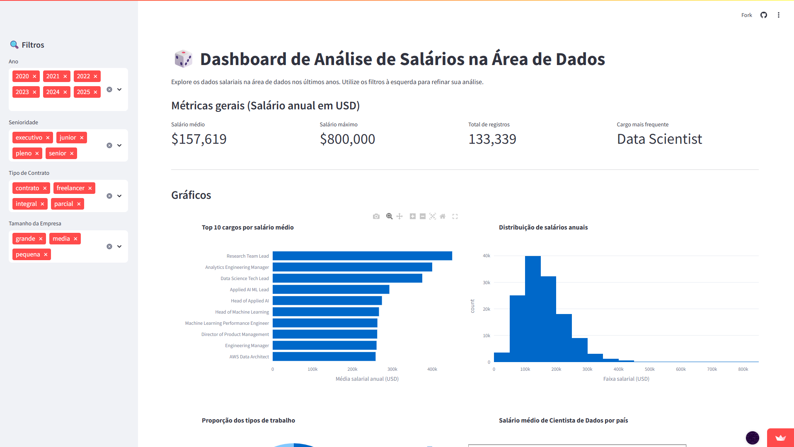
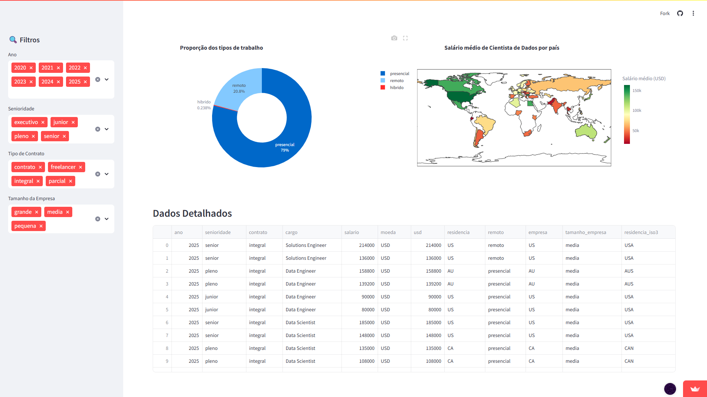

# 📊 Imersão Dados Python 2026


[](https://dashboard-interativo-python-2026.streamlit.app/)

> *Começar do zero é o primeiro passo para ir além.*

Projeto desenvolvido durante a **Imersão Dados com Python 2026**, com foco em **análise exploratória**, **limpeza de dados**, **visualização**, **storytelling** e **construção de dashboards interativos**, utilizando ferramentas amplamente adotadas no mercado.

---

## 🎯 Visão Geral do Projeto

- 📅 **Duração:** 4 aulas práticas
- 🧠 **Área:** Data Analysis / Data Visualization
- 🐍 **Linguagem:** Python
- 🚀 **Entrega final:** Dashboard interativo publicado
- 🌐 **Deploy:** Streamlit Cloud

🔗 **Aplicação em produção:**  
👉 https://dashboard-interativo-python-2026.streamlit.app/

🔗 **Repositório Dedicado Para Projeto Final:**  
👉 https://github.com/MacMenez/dashboard-interativo-python.git

---

## 🎥 Demonstração do Dashboard

> Visualização interativa com filtros dinâmicos e gráficos em tempo real.






> 📌 **Observação:**  
> Substitua o arquivo `dashboard.gif` pelo GIF real do seu projeto.  
> Caminho recomendado: `assets/dashboard.gif`

### Como gerar o GIF:

- Use **ScreenToGif** (Windows) ou **Kap** (Mac)
- Grave a navegação no dashboard
- Exporte como `.gif`
- Salve em `/assets` no repositório

---

## ✨ Highlights do Projeto

- ✔️ Análise exploratória de dados reais
- ✔️ Limpeza e preparação de dados
- ✔️ Visualizações estatísticas
- ✔️ Storytelling com dados
- ✔️ Dashboard interativo com Streamlit
- ✔️ Projeto publicado e acessível online

---

## 🧰 Stack Tecnológica

- 🐍 **Python**
- 📊 **Pandas & NumPy**
- 📈 **Matplotlib & Seaborn**
- 🖥 **Streamlit**
- ☁️ **Google Colab**
- 🧠 **VS Code**
- 🌍 **GitHub**

### Bibliotecas

- `pandas`
- `numpy`
- `matplotlib`
- `seaborn`
- `streamlit`

### Versionamento & Deploy

- **Git & GitHub**
- **Streamlit Cloud**

---

## 📂 Estrutura do Repositório

```bash
├── assets/
│   └── dashboard.gif
├── aulas/
│   ├── aula0
|   |   └── aula_0_liguagem_python.ipynb
├── aula1
|   |   └── aula_01_exploracao_dados.ipynb
│   ├── aula2
|   |   └── aula_02_limpeza_dados.ipynb
│   ├── aula3
|   |   └── aula_03_visualizacao_dados.ipynb
│   └── aula4
|       └── aula_04_dashboard_streamlit.ipynb
├── README.md
└── requirements.txt
```

---

## 📅 Conteúdo da Imersão

---

## 🧩 Aula 01 — Explore Dados com Pandas (27/01)

### Objetivo

Introdução à análise de dados utilizando **Pandas**, com foco em carregamento e exploração inicial de dados.

### O que foi abordado

* Leitura de arquivos CSV
* Estrutura de DataFrames
* Visualização inicial de dados
* Primeiros insights exploratórios

🔗 Projeto base:
[https://github.com/guilhermeonrails/idcp-alura/blob/T8R7W1/Todas_as_aulas_Imers%C3%A3o_dados_com_Python_Alura_Agosto_2025.ipynb](https://github.com/guilhermeonrails/idcp-alura/blob/T8R7W1/Todas_as_aulas_Imers%C3%A3o_dados_com_Python_Alura_Agosto_2025.ipynb)

---

## 🧹 Aula 02 — Limpeza e Preparação dos Dados (28/01)

### Objetivo

Preparar dados para análises mais robustas e confiáveis.

### O que foi trabalhado

* Renomeação de colunas
* Tratamento de valores ausentes
* Filtros
* Estatísticas descritivas

---

## 📊 Aula 03 — Visualização de Dados e Storytelling (29/01)

### Objetivo

Explorar padrões e comunicar insights por meio de gráficos.

### O que foi abordado

* Histogramas
* Boxplots
* Gráficos de barras
* Interpretação visual dos dados

---

## 📈 Aula 04 — Dashboard Interativo com Streamlit (30/01)

### Objetivo

Consolidar todo o aprendizado em um **dashboard interativo**.

### O que foi desenvolvido

* Interface interativa
* Filtros dinâmicos
* Gráficos em tempo real
* Publicação do projeto

🔗 Código base:
[https://github.com/almeidamarcell/imersao-dados-python-alura-2025](https://github.com/almeidamarcell/imersao-dados-python-alura-2025)

---

## 🚀 Como Executar o Projeto

### Google Colab (recomendado)

1. Acesse [https://colab.google/](https://colab.google/)
2. Faça upload do notebook
3. Execute as células

### Execução Local

```bash
pip install -r requirements.txt
streamlit run app.py
```

---

## 🎓 O que este projeto demonstra

* Capacidade de trabalhar com dados reais
* Domínio de análise exploratória
* Boas práticas de limpeza e preparação de dados
* Comunicação visual de insights
* Construção e deploy de aplicações de dados
* Organização de projeto no GitHub

---

## 🏁 Conclusão

Este projeto consolida fundamentos essenciais da **área de dados**, servindo como material de estudo e **projeto de portfólio profissional**, demonstrando competências técnicas e capacidade de entrega de soluções completas.